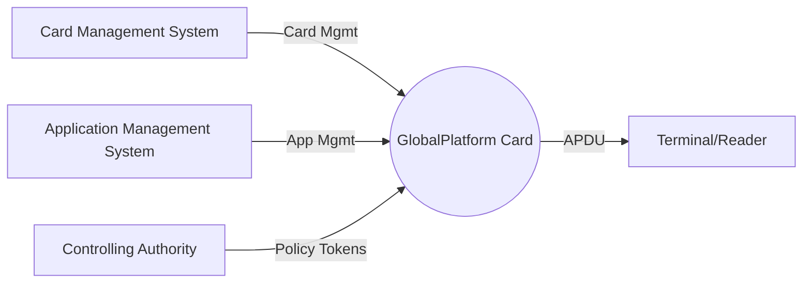
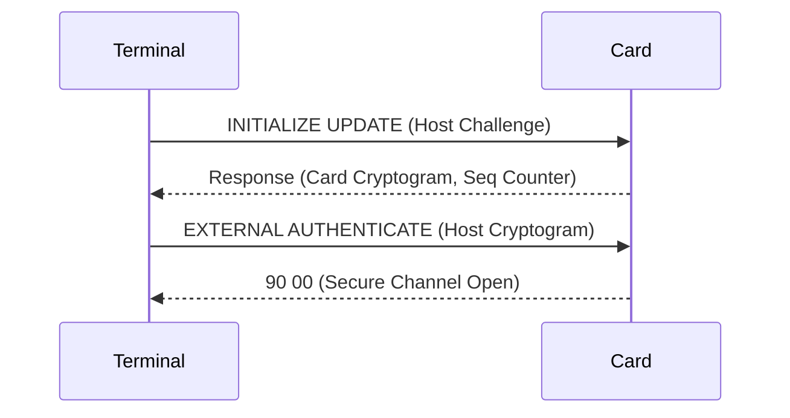

# 2 System Architecture

---

## 2.1 Overview
Defines the separation between off-card management systems, communication interfaces, and the on-card environment.  
This architecture enables secure management of card content and application operations.

<!-- Figure 2-1: GlobalPlatform System Overview -->

<!-- presenter note: Explain that the architecture is role-based — Issuer manages keys, Application Providers manage content, and the CA enforces policy across domains. -->

---

## 2.2 Roles
The GlobalPlatform ecosystem defines four main actors, each with distinct responsibilities.

| Role | Description | Key Responsibilities |
|------|--------------|----------------------|
| **Card Issuer** | Owns the card and establishes trust anchors | Initializes keys, sets lifecycle states, issues cards |
| **Application Provider** | Supplies applets or load files | Develops, signs (DAP), and installs apps |
| **Controlling Authority** | Oversees multi-application security | Manages token issuance, verifies privilege requests |
| **Cardholder** | Uses applications via terminals | Authenticates to applications; provides user inputs |

<!-- Table 2-1: Roles and Responsibilities -->

**Notes:**
- Multiple Application Providers can coexist on one card.  
- The Issuer retains ultimate control via the Issuer Security Domain (ISD).  
- The Controlling Authority may restrict or approve app installation dynamically.

<!-- presenter note: Highlight how roles correspond to SD ownership and token usage. -->

---

## 2.3 Communication and Secure Channel

### Purpose
Enable secure APDU-based communication between the terminal (off-card) and the card (on-card).

### Message Types
- **C-APDU:** Command APDU — sent from terminal to card  
- **R-APDU:** Response APDU — returned by the card  

### Secure Channel Protocols
- **SCP02:** Uses 3DES MAC/ENC (legacy)  
- **SCP03:** Uses AES CMAC/ENC (modern, default)  
- **SCP11:** Uses asymmetric key pairs for mutual authentication  

<!-- Figure 2-2: SCP03 Secure Channel Initialization Flow -->

**Command Protection Layers**
- **MAC:** Provides integrity (detects tampering).  
- **ENC:** Provides confidentiality (encrypts APDU data).  
- **RMAC:** Provides response integrity verification.  

<!-- Table 2-2: SCP03 Cryptographic Layers -->

<!-- presenter note:
Walk through the INITIALIZE UPDATE and EXTERNAL AUTHENTICATE steps.
Explain how the ISD’s static keys derive session keys for S-ENC, S-MAC, and DEK.
-->

---

## 2.4 Secure Communication Layers

GlobalPlatform uses a layered communication stack built upon ISO/IEC 7816 standards.

| Layer | Standard | Description |
|--------|-----------|-------------|
| **Physical Layer** | ISO/IEC 7816-3 | Electrical and signal interface |
| **Transport Layer** | ISO/IEC 7816-3 | Protocols T=0 and T=1 |
| **Application Layer** | ISO/IEC 7816-4 | APDU command/response exchange |
| **Security Layer** | GP SCP02/SCP03/SCP11 | Ensures integrity and confidentiality |

<!-- Table 2-3: Communication Layer Stack -->

**Example:**
1. Application Provider sends an INSTALL command (APDU).  
2. Command is wrapped in SCP03 with AES CMAC and encryption.  
3. Card unwraps, validates MAC, decrypts data, and executes.  
4. Response APDU (R-APDU) is optionally wrapped for integrity.  

<!-- presenter note: Correlate ISO layers with GP security roles. -->

---

## 2.5 Summary

**Key Takeaways:**
- The architecture defines clear trust boundaries between Issuer, Application Provider, and Controlling Authority.  
- Communication uses APDUs standardized by ISO/IEC 7816-4.  
- Secure Channel Protocols (SCP) ensure confidentiality and integrity of commands.  
- The architecture underpins every subsequent GlobalPlatform operation, including content management and privilege enforcement.

<!-- presenter note:
Reinforce the message: “Every GlobalPlatform command is just an APDU — but securely wrapped and role-governed.”
-->
