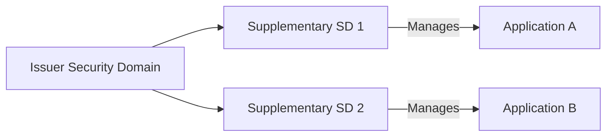
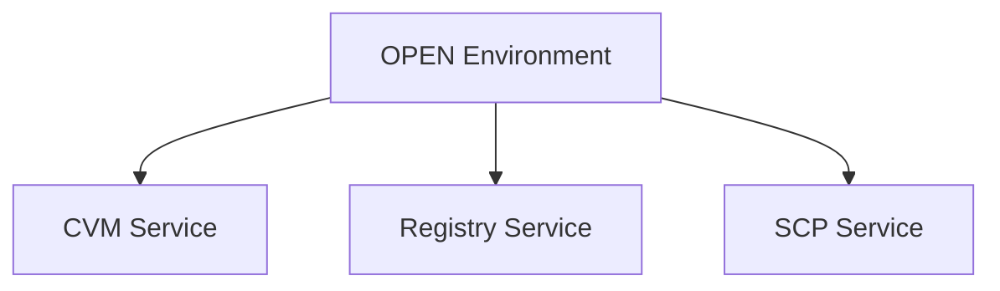
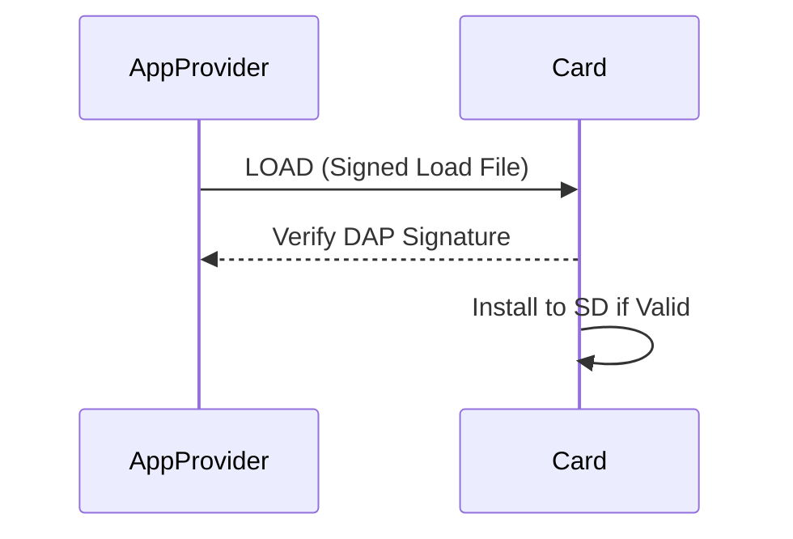
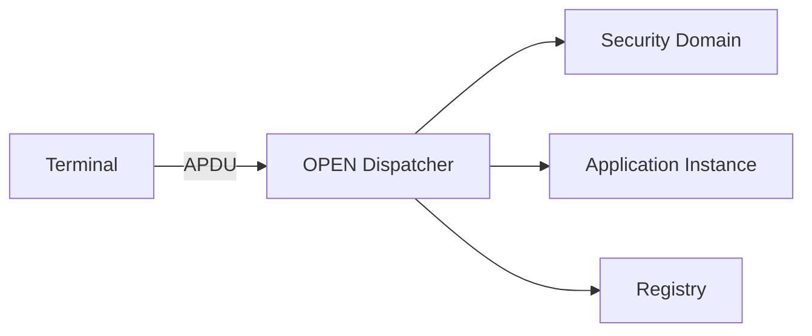

# 3 Card Architecture

---

## 3.1 Security Domains
Security Domains (SDs) act as isolated managers controlling keys, privileges, and application lifecycles.

<!-- Figure 3-1: Security Domain Relationships -->


<!-- Table 3-1: Security Domain Privileges -->
| Privilege | Description |
|------------|-------------|
| Security Domain Management | Create/delete SDs |
| DAP Verification | Verify load file signatures |
| Delegated Management | Allow SD to manage other apps |
| Global Delete | Remove apps installed by others |

**Notes:**
- The Issuer SD (ISD) represents the card issuer.  
- Supplementary SDs belong to Application Providers and operate under tokens from the Controlling Authority.  
- Each SD maintains its own key set and lifecycle.

<!-- presenter note: Highlight the hierarchical structure — ISD at root, SDs below managing specific applications. -->

---

## 3.2 Global Services Applications
Global services provide card-wide utilities such as:
- **Cardholder Verification Method (CVM)**  
- **Registry access**  
- **Secure Channel management**  
- **Lifecycle status query**

**Example:**
```text
GET STATUS [80 F2 40 00] → Returns AID, privileges, and lifecycle state
```

<!-- Figure 3-2: Global Services in the GP Environment -->


<!-- presenter note: Explain that these services are globally accessible through OPEN and not tied to any specific SD. -->

---

## 3.3 Runtime Environment
The Runtime Environment provides:
- A **secure virtual machine** (e.g., Java Card VM)
- **Context switching** between applets
- **Memory isolation** for applications and SDs

**Lifecycle Integration:**
- OPEN dispatches APDUs to selected app contexts.
- Each application instance is uniquely identified by its AID.

<!-- Table 3-2: Runtime Services and Responsibilities -->

---

## 3.4 Trusted Framework
The Trusted Framework defines:
- Certification of applications and load files.
- Enforcement of **mutual trust** between SDs.
- Cryptographic verification of load files via **DAP** (Data Authentication Pattern).

**Concept:**
- Application Providers sign load files with their private key.
- The card validates signatures with the DAP public key stored in the ISD.

<!-- Figure 3-3: Trusted Framework Verification Flow -->


<!-- presenter note: Stress that DAP verification occurs during LOAD, ensuring integrity of loaded content. -->

---

## 3.5 GlobalPlatform Environment (OPEN)
OPEN is the **core GlobalPlatform runtime** that:
- Manages applications and security domains.
- Dispatches incoming APDUs to the correct logical channel.
- Maintains the GlobalPlatform Registry.

<!-- Figure 3-4: OPEN Command Dispatch Architecture -->


**Responsibilities:**
1. Interpret APDU headers (CLA, INS, P1, P2).  
2. Route commands to appropriate entity.  
3. Verify privileges and command access conditions.  

<!-- presenter note: Explain that OPEN is always active and supervises card operations. -->

---

## 3.6 GlobalPlatform API
The API provides standardized access to:
- Secure Channel services (open/close SCP sessions)
- Privilege queries
- Registry and AID enumeration
- Cardholder verification and CVM interaction

**Example API Methods:**
- `openSecureChannel()`
- `getStatus()`
- `getRegistryEntries()`

<!-- presenter note: The GP API abstracts APDU commands for on-card application developers. -->

---

## 3.7 Card Content
Card content is composed of:
1. **Executable Load Files (ELFs)** — bytecode containers.  
2. **Executable Modules** — logical code units.  
3. **Applications** — instantiated modules with lifecycle state.  

**Relationships:**
- One ELF may contain multiple modules.
- Each module may support multiple application instances.

<!-- Table 3-3: Card Content Hierarchy -->
| Component | Description |
|------------|-------------|
| ELF | Container for executable bytecode |
| Module | Logical component loaded from ELF |
| Application | Instantiated entity with AID and state |

---

## 3.8 Card Manager
The Card Manager (also called the **Issuer Security Domain (ISD)** interface):
- Implements the GlobalPlatform command set (`LOAD`, `INSTALL`, `DELETE`, `GET STATUS`, `SET STATUS`).  
- Enforces the issuer’s policy on card content and security domains.  
- Always resides on logical channel 0.

**Command Example:**
```text
80 E8 00 00 [LOAD] – Load Executable File
80 E6 02 00 [INSTALL for Install] – Instantiate Module
80 F0 00 00 [STORE DATA] – Personalize Application
```

<!-- presenter note:
Conclude by reinforcing that the ISD (Card Manager) is the primary management interface for the card’s operational control.
-->
