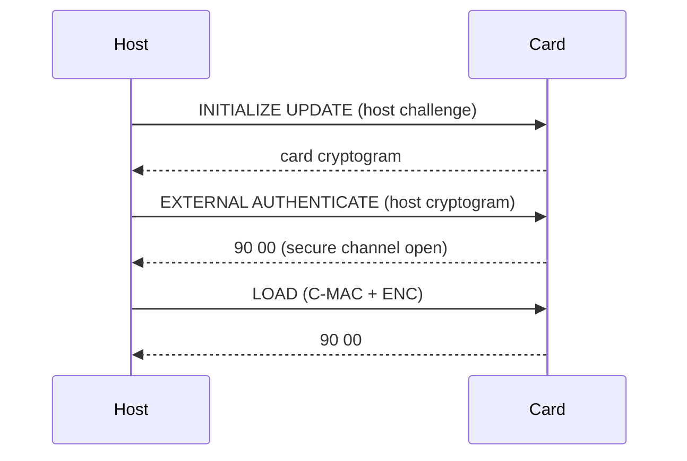

# 4 Security Architecture

---

## 4.1 Goals
The GlobalPlatform security architecture ensures the card and its applications remain trustworthy throughout their lifecycle.

**Objectives:**
- Maintain **confidentiality**, **integrity**, and **authenticity** of data and commands.  
- Support **secure multi-application coexistence**.  
- Enable **delegation** of management responsibilities under cryptographic control.  

<!-- presenter note:
Introduce the three pillars of card security: confidentiality, integrity, and authenticity.
Emphasize interoperability between entities under trust policies.
-->

---

## 4.2 Security Responsibilities and Requirements

### 4.2.1 Card Issuer’s Security Responsibilities
- Personalizes card with unique keys and identifiers.  
- Manages lifecycle transitions from manufacturing to issuance.  
- Ensures cryptographic key derivation and replacement policies.

### 4.2.2 Application Provider’s Security Responsibilities
- Signs all load files using DAP (Data Authentication Pattern).  
- Protects private signing keys.  
- Requests appropriate privileges from the Issuer or Controlling Authority.

### 4.2.3 Controlling Authority’s Security Responsibilities
- Defines operational and privilege policies across SDs.  
- Issues **tokens** to authorize delegated management or app operations.  
- Monitors compliance and may revoke privileges.

### 4.2.4 On-Card Components’ Security Requirements
- Implement **secure messaging (SCP)** for command/response protection.  
- Enforce **privilege checks** before executing commands.  
- Support **lifecycle state verification** before operations.  

### 4.2.5 Back-End System Security Requirements
- Store long-term cryptographic keys securely.  
- Protect management communication channels (CMS ↔ Card).  
- Maintain audit trails of card management operations.  

<!-- Table 4-1: Security Responsibilities by Actor -->

**Notes:**
| Actor | Primary Security Control |
|--------|--------------------------|
| Card Issuer | Key provisioning and card personalization |
| Application Provider | DAP signature and content authenticity |
| Controlling Authority | Policy enforcement and revocation |
| Card Components | Secure command processing |
| Backend Systems | Key storage and operational logging |

---

## 4.3 Cryptographic Support

The card and management systems rely on **symmetric (3DES, AES)** and **asymmetric (RSA, ECC)** algorithms.  
Security operations include key diversification, session key derivation, and message authentication.

---

### 4.3.1 Secure Card Content Management

All **LOAD** and **INSTALL** commands must occur within a secure SCP session.  
Session keys are derived from the ISD’s master keys.

<!-- Figure 4-1: Key Derivation Hierarchy -->
```mermaid
graph LR
  BaseKey[ISD Master Key \(K-ENC, K-MAC, K-DEK\)] -->|Derive| SessionKeys[SCP03 Session Keys \(S-ENC, S-MAC, DEK\)]
  SessionKeys -->|Used For| SecureMsg[Secure Messaging MAC + ENC]
```

**Typical Key Derivation (SCP03):**
- `S-ENC`: AES key for encryption  
- `S-MAC`: AES key for C-MAC (command integrity)  
- `DEK`: AES key for key encryption during loading  

<!-- Table 4-2: Session Key Derivation Parameters -->

**Note:** Key diversification may use card-specific data (e.g., Card Unique ID).

---

### 4.3.2 Secure Communication

GlobalPlatform provides multiple levels of protection:
- **Integrity (C-MAC / R-MAC):** Detects modification or replay.  
- **Confidentiality (C-ENC):** Protects sensitive data.  
- **Authentication:** Ensures issuer or SD control.  

<!-- Figure 4-2: SCP03 Secure Messaging Flow -->


**Session Establishment Process:**
1. Host sends **INITIALIZE UPDATE** with host challenge.  
2. Card replies with a **card cryptogram** derived from its counter.  
3. Host calculates **session keys** and sends **EXTERNAL AUTHENTICATE**.  
4. Secure channel established for subsequent APDUs.  

<!-- presenter note:
Explain that secure communication is layered on top of ISO7816 APDUs.
Use this diagram to show where C-MAC, R-MAC, and ENC operate in message flow.
-->

---

## 4.4 Summary

**Key Points:**
- Each actor has defined security responsibilities.  
- Secure Channel Protocols (SCP) are the foundation of card trust.  
- Keys and cryptograms ensure end-to-end authenticity and confidentiality.  
- Security applies to both command flows and lifecycle transitions.  

<!-- presenter note:
Reinforce that the security model is role-based, layered, and cryptographically enforced.
Transition to next chapter (Lifecycle Models) by noting that lifecycle states control when these mechanisms are active.
-->
