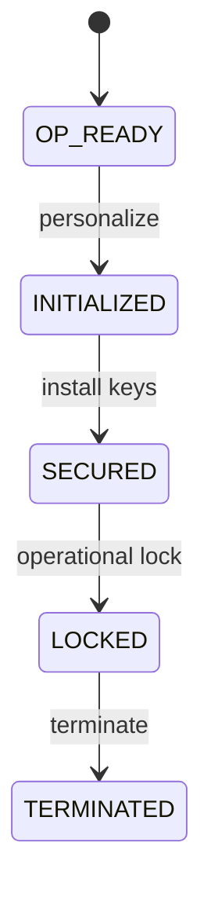
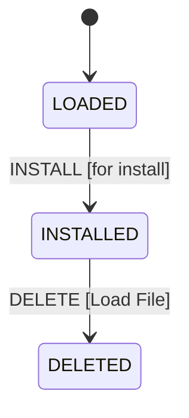
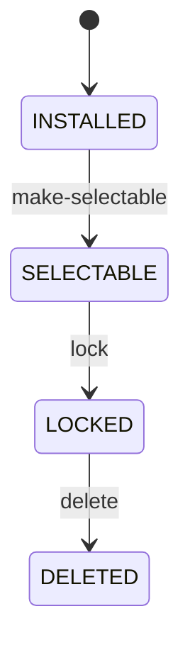
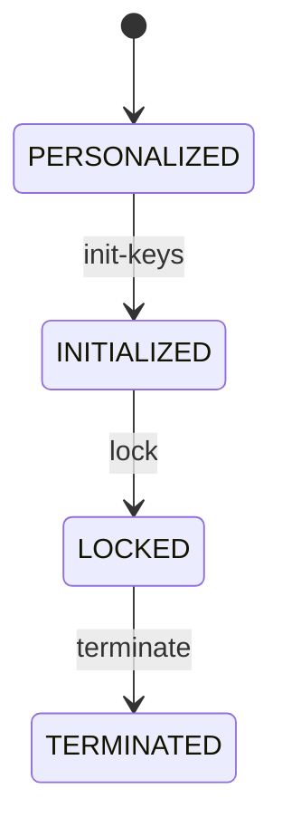
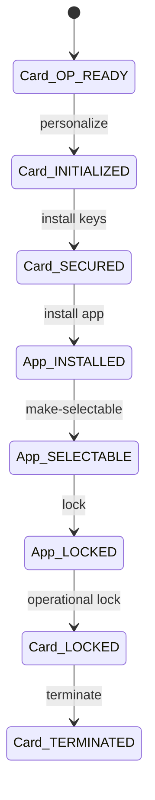

# 5 Lifecycle Models

## Table of Contents
- [5.1 Card Lifecycle](#51-card-life-cycle)
  - [5.1.1 Card Lifecycle States](#511-card-life-cycle-states)
  - [5.1.2 Card Lifecycle Transitions](#512-card-life-cycle-state-transitions)
- [5.2 Executable Load File / Module Lifecycle](#52-executable-load-file--executable-module-life-cycle)
- [5.3 Application and Security Domain Lifecycle](#53-application-and-security-domain-life-cycle)
  - [5.3.1 Application Lifecycle States](#531-application-life-cycle-states)
  - [5.3.2 Security Domain Lifecycle States](#532-security-domain-life-cycle-states)
- [5.4 Sample Lifecycle Illustration](#54-sample-life-cycle-illustration)


# 5 Life Cycle Models

---

## 5.1 Card Life Cycle

### 5.1.1 Card Life Cycle States

Each card passes through a defined sequence of lifecycle states — from manufacturing to termination.

<!-- Table 5-1: Card Life Cycle States -->
| State | Description |
|--------|--------------|
| **OP_READY** | Operational — card prepared for initialization |
| **INITIALIZED** | Card keys loaded, ready for personalization |
| **SECURED** | Card secured with final keys and policies |
| **LOCKED** | Temporarily disabled for operations |
| **TERMINATED** | Permanently deactivated and data erased |

<!-- Figure 5-1: Card Life Cycle State Diagram -->


**Notes:**
- Only the Issuer (via ISD) can change lifecycle states.  
- Transitions require authenticated Secure Channel sessions.  

<!-- presenter note:
Explain that OP_READY → INITIALIZED represents the manufacturer to issuer handover.
SECURED marks card personalization completion; LOCKED and TERMINATED are administrative shutdown states.
-->

---

### 5.1.2 Card Life Cycle State Transitions

Lifecycle transitions are authorized via management APDUs:

| Transition | Command | Privilege Required |
|-------------|----------|--------------------|
| OP_READY → INITIALIZED | INSTALL [for install] | Card Lock/Unlock |
| INITIALIZED → SECURED | STORE DATA | Security Domain Management |
| SECURED → LOCKED | SET STATUS | Card Lock/Unlock |
| LOCKED → TERMINATED | DELETE | Card Termination |

<!-- Table 5-2: Authorized Lifecycle Transitions -->

**Example APDU Sequence:**
```text
=> 80 F0 00 00 [STORE DATA]
<= 90 00 (OK)
=> 80 F0 80 00 [SET STATUS to LOCKED]
<= 90 00
```

---

## 5.2 Executable Load File / Executable Module Life Cycle

Each load file and module has its own lifecycle, independent but synchronized with the card state.

<!-- Figure 5-2: Executable Module Lifecycle -->


**Notes:**
- LOAD operation installs bytecode into EEPROM.  
- DELETE command removes modules and metadata.  
- Modules may coexist across multiple SDs.  

<!-- presenter note:
Show how modules and load files can be independently managed, allowing upgrades without full card reprovisioning.
-->

---

## 5.3 Application and Security Domain Life Cycle

Applications and Security Domains have separate lifecycles, allowing fine-grained management.

---

### 5.3.1 Application Life Cycle States

<!-- Table 5-3: Application Lifecycle States -->
| State | Description |
|--------|--------------|
| **INSTALLED** | Application code loaded onto card |
| **SELECTABLE** | Available for selection via AID |
| **LOCKED** | Disabled from user access |
| **DELETED** | Removed from the card |

<!-- Figure 5-3: Application Lifecycle State Diagram -->


**Note:**  
Lifecycle transitions are controlled by the Security Domain owning the application.  

<!-- presenter note:
Explain that SELECTABLE means the app can respond to SELECT APDUs.
LOCKED prevents access but keeps data intact.
-->

---

### 5.3.2 Security Domain Life Cycle States

<!-- Table 5-4: Security Domain Lifecycle States -->
| State | Description |
|--------|--------------|
| **PERSONALIZED** | Pre-configured with initial keys |
| **INITIALIZED** | Keys finalized; ready for operation |
| **LOCKED** | Temporarily disabled |
| **TERMINATED** | Permanently deactivated |

<!-- Figure 5-4: Security Domain Lifecycle Diagram -->


**Notes:**
- Only the ISD or Controlling Authority can modify SD states.  
- A terminated SD cannot be reactivated.  

<!-- presenter note:
Show that SDs manage keys and privileges — their lifecycle impacts all dependent apps.
-->

---

## 5.4 Sample Life Cycle Illustration

<!-- Figure 5-5: Combined Lifecycle Overview -->


**Lifecycle Synchronization:**
- Applications follow the card lifecycle hierarchy.  
- SDs maintain consistency between app and card states.  
- Secure transitions enforced by SCP sessions.  

<!-- Table 5-5: Lifecycle Dependency Matrix -->
| Component | Depends On | Example Transition |
|------------|-------------|--------------------|
| Application | Security Domain | INSTALL / DELETE |
| SD | Card | INIT / LOCK / TERMINATE |
| Card | CMS | PERSONALIZE / ISSUE / TERMINATE |

<!-- presenter note:
Use this combined view to summarize lifecycle dependencies — Issuer controls card, SD controls app, both secured by SCP.
-->

