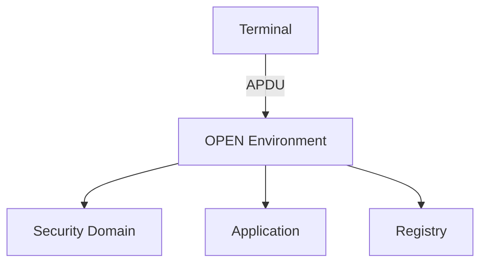
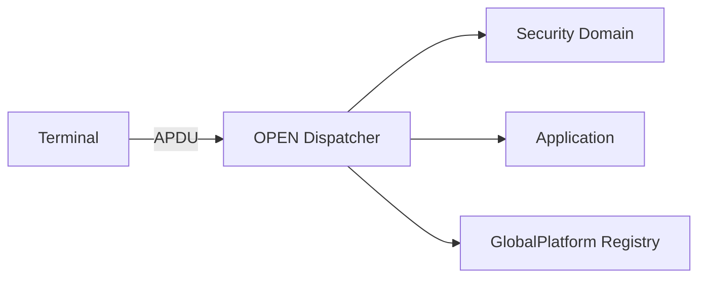
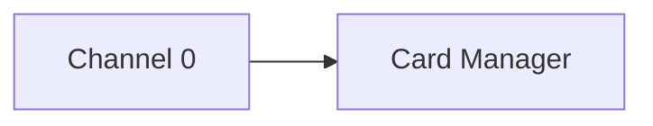
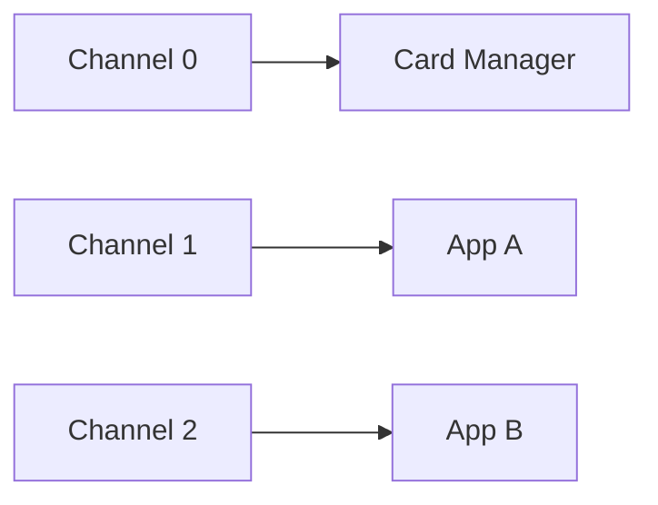
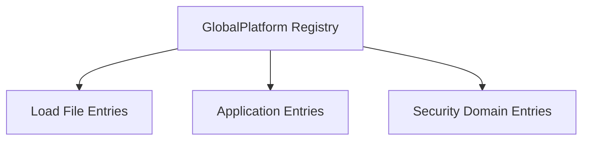
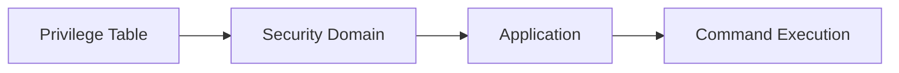
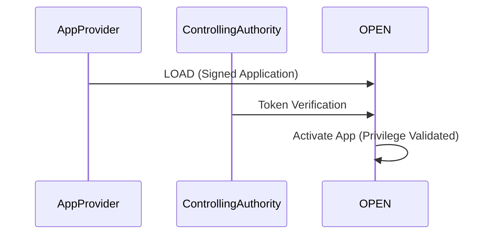

# 6 GlobalPlatform Environment (OPEN)

## Table of Contents
- [6.1 Overview](#61-overview)
- [6.2 OPEN Services](#62-open-services)
- [6.3 Command Dispatch](#63-command-dispatch)
- [6.4 Logical Channels and Application Selection](#64-logical-channels-and-application-selection)
  - [6.4.1 Implicit Selection Assignment](#641-implicit-selection-assignment)
  - [6.4.2 Basic Logical Channel](#642-basic-logical-channel)
  - [6.4.3 Supplementary Logical Channels](#643-supplementary-logical-channels)
- [6.5 GlobalPlatform Registry](#65-globalplatform-registry)
- [6.6 Privileges](#66-privileges)
  - [6.6.1 Privilege Definition](#661-privilege-definition)
  - [6.6.2 Privilege Assignment](#662-privilege-assignment)
  - [6.6.3 Privilege Management](#663-privilege-management)
- [6.7 GlobalPlatform Trusted Framework](#67-globalplatform-trusted-framework)


# 6 GlobalPlatform Environment (OPEN)

---

## 6.1 Overview
The GlobalPlatform Environment (OPEN) serves as the central on-card manager for:
- Application selection  
- APDU command dispatching  
- Secure channel management  
- Privilege verification  
- Lifecycle synchronization  

It acts as a “kernel” within the GlobalPlatform Card, supervising command execution and enforcing security rules.

<!-- Figure 6-1: OPEN System Overview -->


<!-- presenter note:
Explain that OPEN functions as an application router and system security enforcer.
Every APDU received by the card passes through OPEN before reaching any app or SD.
-->

---

## 6.2 OPEN Services
OPEN provides several globally accessible services:

| Service | Description |
|----------|-------------|
| **Channel Management** | Manages basic and supplementary logical channels |
| **Secure Messaging** | Handles SCP session establishment and validation |
| **Registry Access** | Provides status and metadata on card entities |
| **Privilege Verification** | Confirms authorization for operations |
| **Card Locking/Unlocking** | Changes lifecycle state of card or SD |

<!-- Table 6-1: OPEN Services Summary -->

**Example Command Flow:**
1. Terminal opens SCP03 secure channel.  
2. Card routes command through OPEN.  
3. OPEN validates privileges.  
4. Command dispatched to the correct SD or Application.  

---

## 6.3 Command Dispatch

OPEN is responsible for interpreting incoming APDU headers and directing them to the correct on-card component.

**APDU Structure Example:**
| Byte | Name | Description |
|-------|------|-------------|
| CLA | Class | Identifies channel and security level |
| INS | Instruction | Command code |
| P1/P2 | Parameters | Command-specific data |
| Lc/Le | Length fields | Data and response length |

<!-- Figure 6-2: OPEN Command Dispatch Flow -->


**Dispatch Decision Logic:**
- Commands with `CLA = 0x80` → Management (Card Manager/ISD)  
- Commands with `CLA = 0x84` → Application-level commands  
- Supplementary channels handle multi-app concurrency  

<!-- presenter note:
Illustrate how OPEN acts like a microkernel, analyzing CLA to select the right target context.
-->

---

## 6.4 Logical Channels and Application Selection

### 6.4.1 Implicit Selection Assignment
When a card is powered up, **channel 0** is implicitly assigned to the **Card Manager (ISD)**.



**Notes:**
- Channel 0 is always available and cannot be closed.  
- Other channels can be opened with `MANAGE CHANNEL`.  

---

### 6.4.2 Basic Logical Channel
Basic logical channels support one active app context.

| Channel ID | Default Assignment |
|-------------|--------------------|
| 0 | Card Manager |
| 1–19 | Supplementary Channels |

<!-- Figure 6-3: Logical Channel Mapping -->


---

### 6.4.3 Supplementary Logical Channels
Additional channels enable multiple applications to operate concurrently.

**Key Rules:**
- Max 20 channels supported.  
- Each channel has its own logical context.  
- Channels must be explicitly opened and closed.  

**Example Command:**
```text
=> 00 70 00 00 01 (MANAGE CHANNEL)
<= 90 00 (Channel Assigned)
```

<!-- Table 6-2: Logical Channel Operations -->

<!-- presenter note:
Demonstrate that logical channels allow concurrent application sessions on the same physical interface.
-->

---

## 6.5 GlobalPlatform Registry

The Registry maintains metadata about all card entities.

**Stored Data Includes:**
- AID (Application Identifiers)  
- Privileges  
- Lifecycle states  
- Load file references  

<!-- Figure 6-4: GlobalPlatform Registry Structure -->


| Element | Description |
|----------|-------------|
| **AID** | Unique application or load file identifier |
| **Privileges** | Defines allowed operations |
| **Lifecycle** | Current operational state |
| **Parent SD** | Owner of the entity |

<!-- Table 6-3: Registry Data Fields -->

**Note:**  
The Registry is accessible only through the Card Manager or authorized Security Domains.

---

## 6.6 Privileges

### 6.6.1 Privilege Definition
Privileges define which operations a Security Domain or Application can perform.

| Privilege | Description |
|------------|-------------|
| Security Domain Management | Create or delete SDs |
| DAP Verification | Verify load file integrity |
| Delegated Management | Allow SDs to install or delete content |
| Global Delete | Remove card-level objects |
| Card Lock / Unlock | Control lifecycle states |

<!-- Table 6-4: Privilege Definitions -->

---

### 6.6.2 Privilege Assignment
Privileges are assigned during **INSTALL** operations using DAP-signed tokens or by the Card Manager.

```text
=> 80 E6 02 00 [INSTALL for Install]
<= 90 00 (OK)
```

- The token validates Controlling Authority approval.  
- Assigned privileges recorded in Registry.  

---

### 6.6.3 Privilege Management
OPEN enforces privileges dynamically before command execution.

<!-- Figure 6-5: Privilege Enforcement Flow -->


**Rule:**  
Each command must pass privilege validation before being dispatched.  

**Example:**  
- If `DELETE` is invoked by an SD without “Global Delete,” OPEN rejects it with `6985 (Conditions not satisfied)`.  

<!-- presenter note:
Highlight how OPEN consults the Registry before command dispatch, ensuring strict privilege boundaries.
-->

---

## 6.7 GlobalPlatform Trusted Framework

The Trusted Framework defines how applications and Security Domains interoperate securely:

**Components:**
- Certification model for application providers.  
- Cross-domain privilege delegation.  
- Trust relationships maintained via DAP and CA tokens.

**Flow:**
1. Application Provider loads a signed application.  
2. Controlling Authority issues a token authorizing privilege use.  
3. OPEN validates both signature and token before activation.

<!-- Figure 6-6: Trusted Framework Interaction -->


**Outcome:**
- Mutual trust between Issuer, App Provider, and CA.  
- Standardized interoperability across multiple applications.  

<!-- presenter note:
Conclude by emphasizing that OPEN enforces both logical routing and trust management.
Transition to appendix for APDU-level examples.
-->

