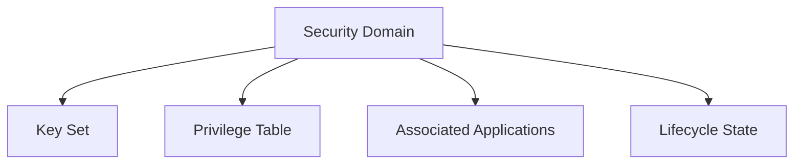

# 7 Security Domains and Privileges

## Table of Contents
- [7.1 Overview](#71-overview)
- [7.2 Security Domain Structure](#72-security-domain-structure)
- [7.3 Privilege Definition](#73-privilege-definition)
- [7.4 Privilege Assignment and Enforcement](#74-privilege-assignment-and-enforcement)
- [7.5 Summary](#75-summary)

---

### 7.1 Overview
A **Security Domain (SD)** is a logical container that holds cryptographic keys, privileges, and management authority for one or more applications.

Each SD can:
- Host applications
- Manage its own keys and secure channels
- Verify digital signatures (DAPs)
- Install or delete content, if authorized

<!-- presenter note:
Reinforce that the SD is both a security perimeter and an administrative authority.
-->

---

### 7.2 Security Domain Structure
Each SD contains:
- **Key Set(s)** (for SCP sessions)
- **Privileges** (granted at creation)
- **Associated Applications**
- **Lifecycle State**

---

### 7.3 Privilege Definition
Privileges control what an SD can do.

| Privilege | Description |
|------------|-------------|
| Security Domain Management | Create or delete other SDs |
| DAP Verification | Verify application signatures |
| Delegated Management | Manage content on behalf of the Issuer |
| Global Delete | Delete objects across the card |
| Global Lock/Unlock | Control lifecycle state |

---

### 7.4 Privilege Assignment and Enforcement
Privileges are assigned by:
1. The **Issuer** (during INSTALL [for load])
2. A **Controlling Authority** (via token)
3. The **OPEN Environment**, which enforces them

<!-- presenter note:
Explain how privilege enforcement occurs before every command execution.
-->

---

### 7.5 Summary
Security Domains are trust boundaries.  
They allow multiple entities to share one secure element while maintaining isolation and delegated control.
