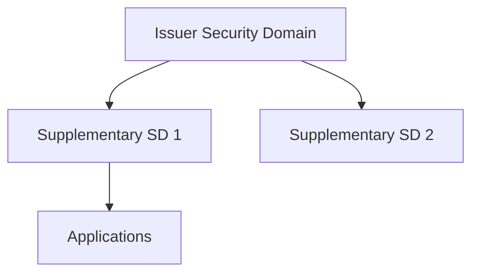
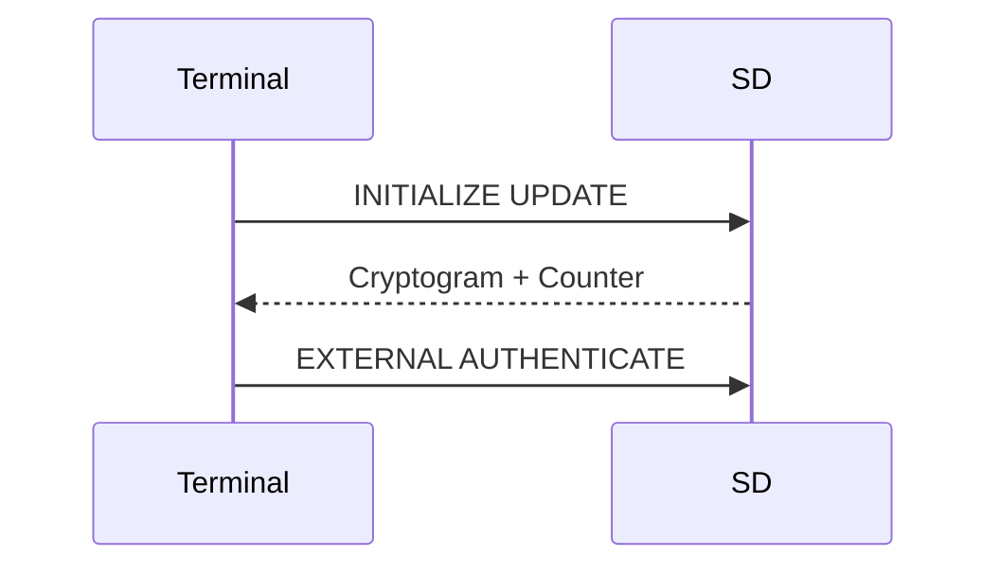

# 7 Security Domains

## Table of Contents
- [7.1 General Description](#71-general-description)
  - [7.1.1 Issuer Security Domain](#711-issuer-security-domain)
- [7.2 Security Domain Association](#72-security-domain-association)
- [7.3 Security Domain Services](#73-security-domain-services)
  - [7.3.1 Security Domain Support for Secure Messaging](#731-security-domain-support-for-secure-messaging)
  - [7.3.2 Security Domain Support for Application Personalization](#732-security-domain-support-for-application-personalization)
- [7.4 Security Domain Data](#74-security-domain-data)
  - [7.4.1 Issuer Security Domain](#741-issuer-security-domain)
  - [7.4.2 Supplementary Security Domains](#742-supplementary-security-domains)
- [7.5 Security Domain Keys](#75-security-domain-keys)
  - [7.5.1 Key Information](#751-key-information)
  - [7.5.2 Key Access Conditions](#752-key-access-conditions)
- [7.6 Data and Key Management](#76-data-and-key-management)

---

### 7.1 General Description
A **Security Domain (SD)** is an on-card entity that manages applications and enforces security rules through cryptographic keys and privileges.

Each SD can:
- Host and manage applications  
- Establish secure channels  
- Perform delegated content management  
- Provide cryptographic services  

---

#### 7.1.1 Issuer Security Domain
The **Issuer Security Domain (ISD)** is the master SD responsible for:
- Card initialization and key provisioning  
- Card lifecycle control  
- Secure channel root key derivation  

It always exists and cannot be deleted.

---

### 7.2 Security Domain Association
Security Domains may be **hierarchically associated** — the ISD can create or delete supplementary SDs.

Each SD’s **association** is stored in the GlobalPlatform Registry.

---

### 7.3 Security Domain Services
Security Domains expose a defined set of services to applications or other SDs.

#### 7.3.1 Security Domain Support for Secure Messaging
Each SD maintains its own secure channel parameters and keys.  
Secure messaging is managed through SCP sessions.

#### 7.3.2 Security Domain Support for Application Personalization
An SD can allow personalization data to be sent securely to its applications via the `STORE DATA` command, under secure channel protection.

---

### 7.4 Security Domain Data

#### 7.4.1 Issuer Security Domain
The ISD stores:
- Card-wide data elements  
- Lifecycle state  
- Registry references  

#### 7.4.2 Supplementary Security Domains
Supplementary SDs store:
- Privilege table  
- Associated app AIDs  
- Local keys for secure sessions  

---

### 7.5 Security Domain Keys

#### 7.5.1 Key Information
Keys include:
- **Key-ENC / Key-MAC / Key-DEK** for SCP  
- **Key Version Numbers (KVN)** for rotation tracking  

#### 7.5.2 Key Access Conditions
Keys can be read or updated only by authorized entities (e.g., ISD or Controlling Authority) under secure messaging.

---

### 7.6 Data and Key Management
Security Domains handle key rotation, derivation, and update through SCP mechanisms.  
Issuers may derive diversified keys per card or per SD.
