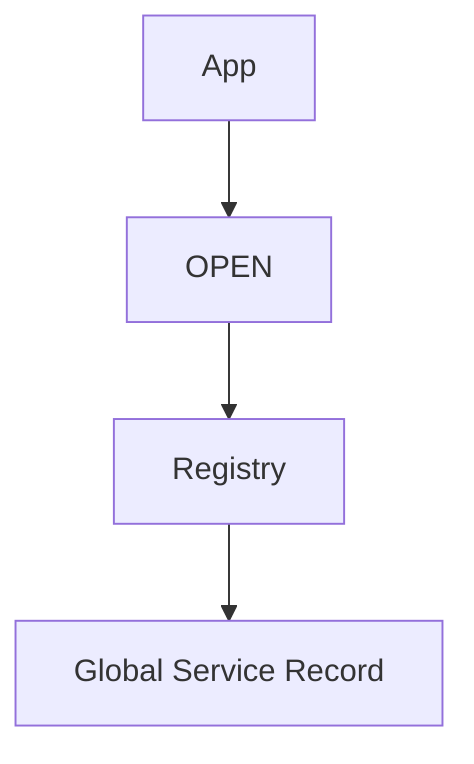

# 8 GlobalPlatform Services

## Table of Contents
- [8.1 Global Services Applications](#81-global-services-applications)
  - [8.1.1 Registering Global Services](#811-registering-global-services)
  - [8.1.2 Application Access to Global Services](#812-application-access-to-global-services)
  - [8.1.3 Global Service Parameters](#813-global-service-parameters)
- [8.2 CVM Application](#82-cvm-application)
  - [8.2.1 Application Access to CVM Services](#821-application-access-to-cvm-services)
  - [8.2.2 CVM Management](#822-cvm-management)

---

### 8.1 Global Services Applications
**Global Services** are shared applications accessible by other on-card applications via standardized APIs.

Typical examples:
- Cardholder verification (CVM)
- Secure data storage
- Shared cryptographic functions

---

#### 8.1.1 Registering Global Services
A Global Service registers with the **OPEN environment**, which stores its service AID and parameters in the Registry.

#### 8.1.2 Application Access to Global Services
Applications discover and bind to services using their AID.  
Access is governed by privileges and service configuration.

#### 8.1.3 Global Service Parameters
Parameters define:
- Access control list (ACL)
- Communication mode (internal or external)
- API entry points

---

### 8.2 CVM Application
The **Cardholder Verification Method (CVM)** Application provides identity verification services such as PIN, biometric, or token validation.

#### 8.2.1 Application Access to CVM Services
Applications call CVM functions using the GlobalPlatform API, verifying user presence before critical operations.

#### 8.2.2 CVM Management
CVM parameters (PIN length, retry counter, blocking policy) are maintained by the Issuer and accessible only through the CVM management interface.
