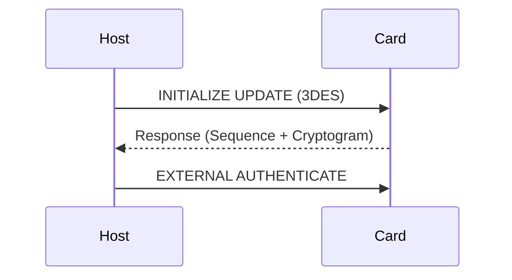
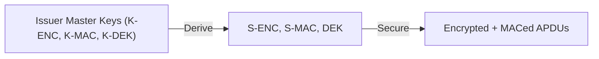

# 8 Secure Channel Protocols

## Table of Contents
- [8.1 Overview](#81-overview)
- [8.2 SCP01 and SCP02](#82-scp01-and-scp02)
- [8.3 SCP03 (AES-based)](#83-scp03-aes-based)
- [8.4 SCP11 (Public-Key)](#84-scp11-public-key)
- [8.5 Security Comparison](#85-security-comparison)
- [8.6 Summary](#86-summary)

---

### 8.1 Overview
Secure Channel Protocols (SCPs) protect all management commands exchanged between off-card entities and the card.

They ensure:
- Mutual authentication  
- Integrity and confidentiality  
- Replay protection  

---

### 8.2 SCP01 and SCP02
Older SCPs based on 3DES:
- **SCP01**: Basic session derivation  
- **SCP02**: Adds C-MAC and C-ENC for command protection  

---

### 8.3 SCP03 (AES-based)
Modern protocol using AES keys for:
- S-ENC (encryption)
- S-MAC (integrity)
- DEK (key wrapping)

---

### 8.4 SCP11 (Public-Key)
Public-key-based SCP for high-assurance use cases.
- Mutual authentication via EC Diffie-Hellman  
- Protects against cloning and replay  
- Often used in eUICC and embedded environments

---

### 8.5 Security Comparison

| SCP | Key Type | Crypto | Typical Use |
|------|-----------|---------|--------------|
| SCP01 | Symmetric | 3DES | Legacy cards |
| SCP02 | Symmetric | 3DES | Payment cards |
| SCP03 | Symmetric | AES | Modern SEs, SIM/eSIM |
| SCP11 | Asymmetric | ECC | High security / remote provisioning |

---

### 8.6 Summary
SCP03 is the current standard for symmetric secure channels, while SCP11 enables asymmetric mutual authentication for next-generation platforms.
