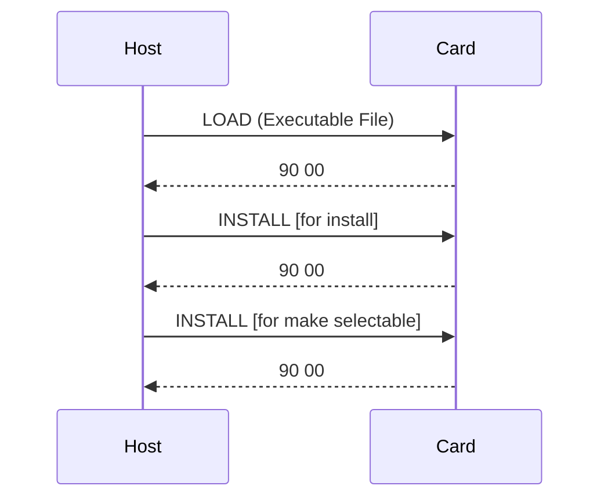

# 9 Card and Application Management

## Table of Contents
- [9.1 Card Content Management](#91-card-content-management)
  - [9.1.1 Overview](#911-overview)
  - [9.1.2 OPEN Requirements](#912-open-requirements)
  - [9.1.3 Security Domain Requirements](#913-security-domain-requirements)
- [9.2 Authorizing and Controlling Card Content](#92-authorizing-and-controlling-card-content)
  - [9.2.1 DAP Verification](#921-dap-verification)
  - [9.2.2 Load File Data Block Hash](#922-load-file-data-block-hash)
  - [9.2.3 Tokens](#923-tokens)
- [9.3 Card Content Loading, Installation and Make Selectable](#93-card-content-loading-installation-and-make-selectable)
  - [9.3.1 Overview](#931-overview)
  - [9.3.2 Card Content Loading](#932-card-content-loading)
  - [9.3.3 Card Content Installation](#933-card-content-installation)
  - [9.3.4 Combined Loading, Installation and Make Selectable](#934-combined-loading-installation-and-make-selectable)
  - [9.3.9 Examples of Loading and Installation Flow](#939-examples-of-loading-and-installation-flow)
- [9.4 Content Extradition and Registry Update](#94-content-extradition-and-registry-update)
- [9.5 Content Removal](#95-content-removal)
- [9.6 Security Management](#96-security-management)
- [9.7 Memory Resource Management](#97-memory-resource-management)

---

### 9.1 Card Content Management
Defines how card content (applications, modules, SDs) is securely loaded, installed, and deleted.

#### 9.1.1 Overview
Card content management occurs only under secure channels and verified privileges.

#### 9.1.2 OPEN Requirements
OPEN must provide lifecycle synchronization and APDU routing for management commands.

#### 9.1.3 Security Domain Requirements
Each SD manages its own applications and must support SCP03 and DAP verification.

---

### 9.2 Authorizing and Controlling Card Content

#### 9.2.1 DAP Verification
The **Data Authentication Pattern (DAP)** signature verifies that an application is authentic and unmodified.

#### 9.2.2 Load File Data Block Hash
Ensures integrity for partial loads or multi-block loading.

#### 9.2.3 Tokens
Tokens from a Controlling Authority authorize delegated installation.

---

### 9.3 Card Content Loading, Installation and Make Selectable

#### 9.3.1 Overview
Applications are loaded (code), installed (instance), and made selectable (activated).

#### 9.3.2 Card Content Loading
Performed using `LOAD` command under SCP03.

#### 9.3.3 Card Content Installation
Performed using `INSTALL [for install]` command.

#### 9.3.4 Combined Loading, Installation and Make Selectable
Supported for efficiency — all operations occur in one sequence.

#### 9.3.9 Examples of Loading and Installation Flow

---

### 9.4 Content Extradition and Registry Update
Moving or deleting content triggers updates in the GlobalPlatform Registry.

---

### 9.5 Content Removal
Applications and Load Files can be removed only by an SD with the “Delete” privilege.

---

### 9.6 Security Management
Security Management operations include:
- Lifecycle control (`SET STATUS`)
- Locking / unlocking applications or the card
- Card termination and reactivation
- Event logging

---

### 9.7 Memory Resource Management
OPEN manages memory quotas per SD and ensures no entity exceeds its allocation.
