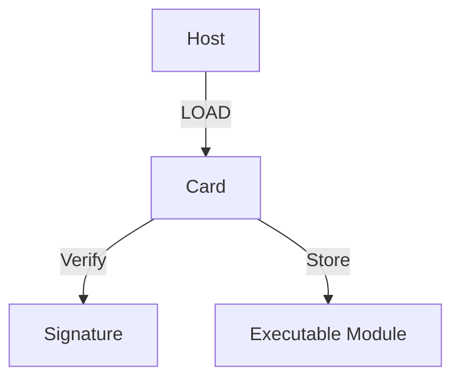

# 9 Loading and Installation

## Table of Contents
- [9.1 Overview](#91-overview)
- [9.2 Executable Load Files](#92-executable-load-files)
- [9.3 INSTALL Commands](#93-install-commands)
- [9.4 DAP Verification](#94-dap-verification)
- [9.5 Example Sequence](#95-example-sequence)
- [9.6 Summary](#96-summary)

---

### 9.1 Overview
GlobalPlatform defines a controlled process for loading and installing applications.  
All operations occur inside a secure channel session and are validated by signatures and privileges.

---

### 9.2 Executable Load Files
An **Executable Load File** contains code modules that are verified, loaded, and linked on-card.



---

### 9.3 INSTALL Commands
There are several INSTALL variants:
| Command | Purpose |
|----------|----------|
| INSTALL [for load] | Prepares a Load File |
| INSTALL [for install] | Instantiates an Application |
| INSTALL [for make selectable] | Activates an Application |
| INSTALL [for extradition] | Deletes or moves entities |

---

### 9.4 DAP Verification
The **Data Authentication Pattern (DAP)** validates application integrity.  
OPEN verifies the DAP signature before installation.

---

### 9.5 Example Sequence
```text
=> 80 E8 00 00 [LOAD]
<= 90 00
=> 80 E6 0C 00 [INSTALL for load]
<= 90 00
=> 80 E6 02 00 [INSTALL for install]
<= 90 00
```

<!-- presenter note:
Explain that each step is validated by privilege and cryptographic check before proceeding.
-->

---

### 9.6 Summary
Loading and installation are at the heart of GlobalPlatform’s trusted application management model — secure, verifiable, and controlled.
