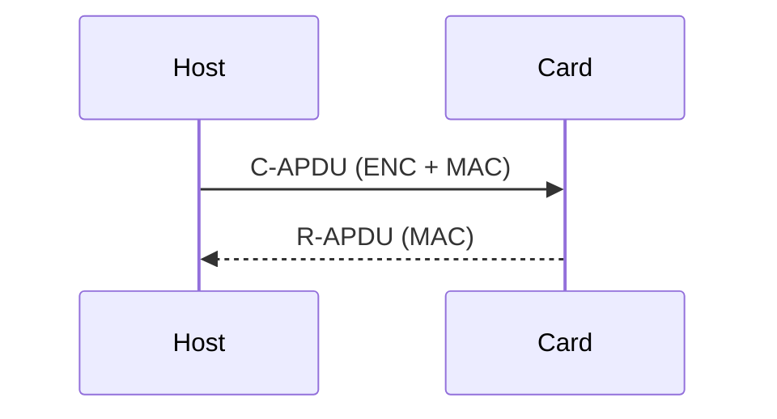

# 10 Secure Communication

## Table of Contents
- [10.1 Secure Channel](#101-secure-channel)
- [10.2 Explicit / Implicit Secure Channel](#102-explicit--implicit-secure-channel)
  - [10.2.1 Explicit Secure Channel Initiation](#1021-explicit-secure-channel-initiation)
  - [10.2.2 Implicit Secure Channel Initiation](#1022-implicit-secure-channel-initiation)
  - [10.2.3 Secure Channel Termination](#1023-secure-channel-termination)
- [10.3 Direct / Indirect Handling of SCP](#103-direct--indirect-handling-of-scp)
- [10.4 Entity Authentication](#104-entity-authentication)
  - [10.4.1 Authentication with Symmetric Cryptography](#1041-authentication-with-symmetric-cryptography)
  - [10.4.2 Authentication with Asymmetric Cryptography](#1042-authentication-with-asymmetric-cryptography)
- [10.5 Secure Messaging](#105-secure-messaging)
- [10.6 Security Levels](#106-security-levels)
- [10.7 Secure Channel Protocol Identifier](#107-secure-channel-protocol-identifier)

---

### 10.1 Secure Channel
A **Secure Channel** is a protected logical link established between a card and an off-card entity, providing integrity, confidentiality, and replay protection.

---

### 10.2 Explicit / Implicit Secure Channel

#### 10.2.1 Explicit Secure Channel Initiation
Triggered by the terminal via `INITIALIZE UPDATE` and `EXTERNAL AUTHENTICATE`.

#### 10.2.2 Implicit Secure Channel Initiation
Automatically initiated by the card when policy requires protection for specific commands.

#### 10.2.3 Secure Channel Termination
Occurs when:
- A `MANAGE CHANNEL` closes the logical channel  
- The session keys expire  
- Card lifecycle changes  

---

### 10.3 Direct / Indirect Handling of SCP
**Direct handling**: Host directly exchanges SCP commands.  
**Indirect handling**: Another on-card entity (e.g., SD) proxies the SCP communication.

---

### 10.4 Entity Authentication

#### 10.4.1 Authentication with Symmetric Cryptography
Used in SCP02 and SCP03.  
Relies on shared AES or 3DES keys.

#### 10.4.2 Authentication with Asymmetric Cryptography
Used in SCP11.  
Employs ECC or RSA key pairs and mutual certificate verification.

---

### 10.5 Secure Messaging
All APDUs under an SCP session include MACs and optional encryption.  
Protection may apply to command, response, or both directions.

---

### 10.6 Security Levels

| Level | Protection | Description |
|--------|-------------|-------------|
| 0 | None | Plaintext communication |
| 1 | C-MAC | Integrity only |
| 3 | C-MAC + C-ENC | Integrity + Encryption |
| 15 | Full Secure Messaging | Maximum protection |

---

### 10.7 Secure Channel Protocol Identifier
Each SCP type is assigned a unique identifier (e.g., `SCP03 = 0x03`, `SCP11 = 0x11`), stored in the Registry for session tracking.
