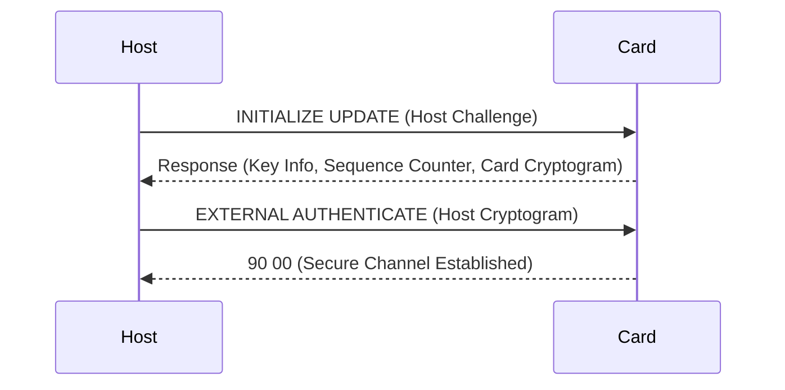
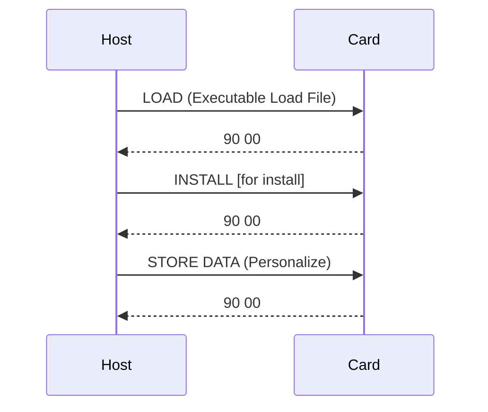
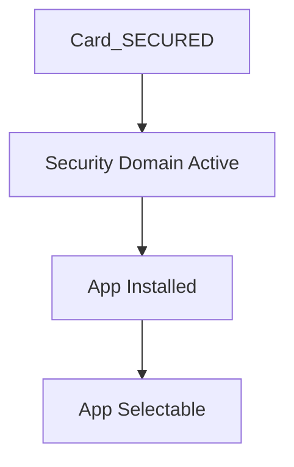

# Appendix A — APDU Flow Examples

---

## A.1 SCP03 Secure Channel Establishment

This example demonstrates a standard SCP03 initialization sequence between a terminal (off-card) and the Issuer Security Domain (ISD) on the card.

**Participants:**
- **Host/Terminal:** Initiates secure channel setup  
- **Card/ISD:** Responds with cryptograms and establishes session keys  

---

### A.1.1 Initialization Flow

<!-- Figure A-1: SCP03 Initialization Flow -->


**Command Exchange Example:**
```text
=> 80 50 00 00 08 [Host Challenge]
<= 00 00 00 00 00 00 00 00 00 00 00 00 00 00 00 00 [Card Response]
=> 84 82 00 00 10 [Host Cryptogram]
<= 90 00
```

**Derived Session Keys (SCP03):**
| Key | Description |
|------|--------------|
| S-ENC | Encryption of C-APDU data |
| S-MAC | Command integrity verification |
| DEK | Data encryption key (for key loading) |

**Session Establishment Steps:**
1. Host generates an 8-byte random challenge.  
2. Card replies with sequence counter and cryptogram.  
3. Host derives session keys from static ISD keys.  
4. Secure channel established — all further commands are MACed/encrypted.  

<!-- presenter note:
Emphasize AES CMAC integrity protection and key derivation from static issuer keys.
-->

---

## A.2 Application Loading and Installation

This example illustrates a **secure content management sequence** — loading and installing an application over SCP03.

---

### A.2.1 Application Load Flow

**Command Sequence (Simplified):**
```text
=> 80 E8 00 00 [LOAD Command]  ; Send Executable Load File
<= 90 00

=> 80 E6 02 00 [INSTALL for Install] ; Instantiate Application
<= 90 00

=> 80 F0 00 00 [STORE DATA] ; Personalization Data
<= 90 00
```

<!-- Figure A-2: LOAD/INSTALL Command Flow -->


**Security Conditions:**
- The SCP03 session must remain active during LOAD and INSTALL.  
- Application must be signed by the Application Provider (DAP).  
- Privilege token from Controlling Authority may be required for activation.  

**Example:**
```text
=> 80 E6 0C 00 [INSTALL for Load]
=> 80 E6 02 00 [INSTALL for Install]
=> 80 F0 00 00 [STORE DATA]
<= 90 00
```

<!-- Table A-1: Application Load and Installation Steps -->
| Step | Command | Description | Condition |
|------|----------|-------------|-----------|
| 1 | LOAD | Load Executable Load File | Secure Channel Active |
| 2 | INSTALL (Load) | Create Load File Instance | Requires DAP Verification |
| 3 | INSTALL (Install) | Create Application Instance | Requires Token |
| 4 | STORE DATA | Personalize App Data | Card in SECURED state |

---

### A.2.2 Life Cycle Synchronization
Application and Security Domain lifecycles must align during installation.

<!-- Figure A-3: Installation Context -->


**Key Principle:**
- Installation can occur only when the card is in **SECURED** state.  
- The Security Domain must be **INITIALIZED** or higher.  
- Privileges determine which SD can perform INSTALL operations.  

<!-- presenter note:
Highlight that successful installation depends on both the card and SD lifecycle states.
Use this section to tie lifecycle management back to practical APDU flows.
-->

---

## A.3 Application Deletion and Termination

### A.3.1 Application Deletion Example
```text
=> 80 E4 00 00 [DELETE (Application AID)]
<= 90 00
```

**Notes:**
- Requires “Global Delete” privilege.  
- The app must not be currently selected or active.  

---

### A.3.2 Card Termination Example
```text
=> 80 F0 80 00 [SET STATUS to TERMINATED]
<= 90 00
```

**Effects:**
- All Security Domains and Applications marked TERMINATED.  
- SCP sessions closed permanently.  
- Card returns to non-operational state.  

<!-- presenter note:
Conclude with the idea that lifecycle and secure channel management combine to maintain the card’s long-term trustworthiness.
-->
