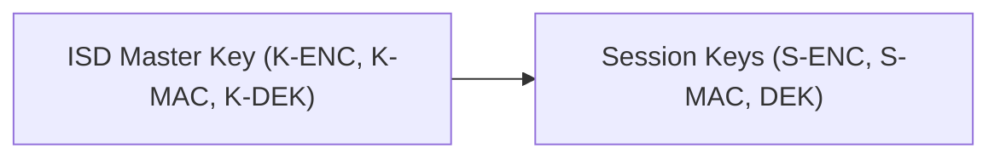

# GPCS-Presentation  
## GlobalPlatform Card Specification (v2.3.1) — Engineering Presentation Package

---

### 📘 Overview  
This repository provides **engineering-level presentation materials** for the  
**GlobalPlatform Card Specification v2.3.1**, covering **Chapters 2–6** and **Appendix A**.  

It is designed for **engineers, developers, and architects** to use in internal trainings,  
wiki documentation, or conference-style presentations.  

Each file includes:
- Accurate section numbering matching the GlobalPlatform spec  
- Embedded **Mermaid diagrams** (for APDU flow, architecture, lifecycles)  
- **Presenter notes** in HTML comments  
- Tables and figure placeholders for expansion  

---

### 📂 Repository Structure
```text
GPCS-Presentation/
│
├── 00_Session_Overview.md
├── 02_System_Architecture.md
├── 03_Card_Architecture.md
├── 04_Security_Architecture.md
├── 05_Lifecycle_Models.md
├── 06_GlobalPlatform_Environment.md
├── Appendix_A_APDU_Flow_Examples.md
└── README.md
```

---

### 🧩 File Descriptions

| File | Contents | Purpose |
|------|-----------|----------|
| `00_Session_Overview.md` | Presentation objectives, schedule, outcomes | Kickoff for session |
| `02_System_Architecture.md` | System roles, secure channel, communication flow | Big-picture architecture |
| `03_Card_Architecture.md` | Security Domains, OPEN, card content hierarchy | On-card logical design |
| `04_Security_Architecture.md` | Security responsibilities, SCP03 key derivation | Cryptographic foundation |
| `05_Lifecycle_Models.md` | Card, SD, and application lifecycles | State and transition behavior |
| `06_GlobalPlatform_Environment.md` | OPEN dispatch, logical channels, registry | Runtime environment control |
| `Appendix_A_APDU_Flow_Examples.md` | SCP03 and LOAD/INSTALL APDU flow examples | Wire-level demonstration |

---

### 🛠️ Usage Instructions

1. **Clone or download** the repository:
   ```bash
   git clone https://github.com/HoangDuyTuan/GPCS-Presentation.git
   ```
2. Open `.md` files in your internal wiki, GitHub viewer, or Markdown editor.  
3. **Mermaid diagrams** render automatically on GitHub, GitLab, and VS Code.  
4. Replace placeholders like `<!-- Figure 2-1: ... -->` with actual diagrams if available.  
5. Use embedded `<!-- presenter note: ... -->` comments as speech prompts.

---

### 🎨 Mermaid Rendering Notes

GitHub supports Mermaid natively.  
If you’re using another platform (Confluence, MkDocs, Marp), ensure Mermaid rendering is enabled.

✅ **Safe syntax example:**
graph LR
  A["Card Manager (ISD)"] --> B["Security Domain (SD)"]
  B --> C["Application Instance (AID)"]

⚠️ **Avoid parser errors:**  
If your node labels include parentheses or commas, wrap them in quotes:


---

### 🧠 Presenter Tips (30–60 min session)

- Start with the big picture — *GlobalPlatform = secure lifecycle governance for smart cards*.  
- Use the **Mermaid diagrams** in Chapters 2–6 to visually explain flows and roles.  
- Refer to the embedded comments as your speaker notes.  
- The session is designed for 45 minutes:
  - 5 min – Introduction  
  - 10 min – System & Card Architecture  
  - 10 min – Security Architecture  
  - 10 min – Lifecycle Models  
  - 8 min – OPEN Environment  
  - 5 min – Appendix (APDU examples)  
  - 2 min – Recap & Q&A  

💬 Key takeaway quote:
> “Every GlobalPlatform command is just an APDU — but securely wrapped, role-governed, and lifecycle-controlled.”

---

### 📄 License & Attribution

This material reinterprets concepts from the  
**GlobalPlatform Card Specification v2.3.1 (Public Release)**  
for **educational and internal training use**.  

All trademarks and proprietary content remain the property of **GlobalPlatform, Inc.**

---

### 🤝 Contributing
Feel free to:
- Submit pull requests for corrections or diagram improvements  
- Add translated versions for multilingual engineering teams  
- Extend with future chapters (e.g., Secure Channel Protocols Appendix)

---

*Maintained by Hoang Duy Tuan • GlobalPlatform Engineering Presentation Repository*
